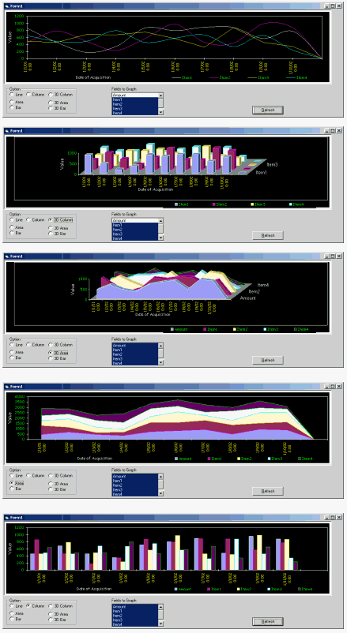



## Graph \*\*IMPROVED\*\*\_\#3

### Description

GRAPH! **IMPROVED** This shows the power of the Function to create graph. You can now Maximize/Restore Graph with out distorting the picture. Printing is now available too. It can Dynamically regenerate itself with the change of select statement. This will show you how to make graph either Smooth Line, Bar, Area, Column, 3D Column, 3D Line, 3D Area... etc. I find it so nice, the graph function is so short, you'll love it... please leave some comments and your vote if you like it!!!
 
### More Info
 

             |
---                |---
**Submitted On**   |2002-09-13 17:35:20
**By**             |[Scorcel](https://github.com/Planet-Source-Code/PSCIndex/blob/master/ByAuthor/scorcel.md)
**Level**          |Intermediate
**User Rating**    |4.9 (195 globes from 40 users)
**Compatibility**  |VB 5\.0, VB 6\.0
**Category**       |[Complete Applications](https://github.com/Planet-Source-Code/PSCIndex/blob/master/ByCategory/complete-applications__1-27.md)
**World**          |[Visual Basic](https://github.com/Planet-Source-Code/PSCIndex/blob/master/ByWorld/visual-basic.md)
**Archive File**   |[Graph\_\_\_IM1374749282002\.zip](https://github.com/Planet-Source-Code/scorcel-graph-improved-3__1-38678/archive/master.zip)

